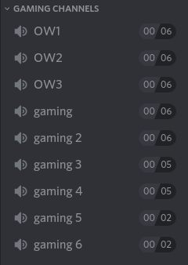
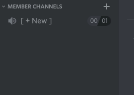

# Dynamic Members

### A Discord bot to dynamically create voice channels for users 

# Why?
Often, you see servers with excessive lists of voice channels labeled:

This project aims to fix that by basing the voice channels on users and only creating the channels when said user wants to.

# How does it work?
When the bot joins your server, it'll create two default channels. A category channel named `Dynamic Channels` and underneath it a placehold voice channel called `[+] Create channel`

When any user joins the placehold channel, the bot:
- Creates a voice channel named `User's channel` with the users' name
- Gives the uesr permission to manage that channel
- Moves the user into the channel
Once all users have left a channel and it has become empty, the channel will be removed.

## Renaming
If any of the channels are renamed, including the category and the placehold voice channel, the name will be remembered.

For example, if a user named `ImAHuman` renames their channel from the default `IAmHuman's Channel` to `This is my channel"`, then from then on when `ImAHuman` joins the placeholder, it'll name their channel `This is my channel`
